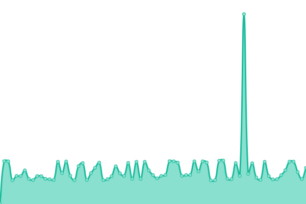
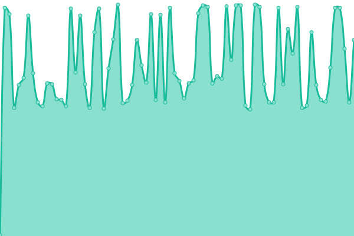
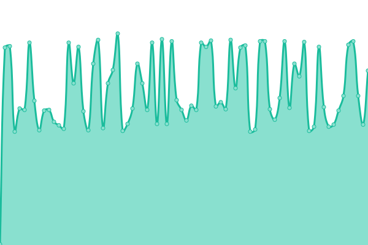
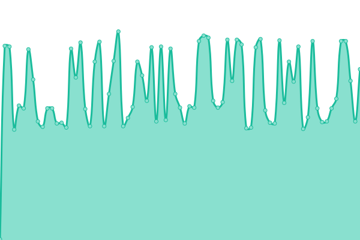
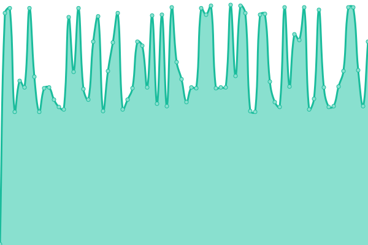

# [📈 Live Status](https://servers.status.spookhost.xyz): <!--live status--> **All servers are operational**

This repository contains the open-source uptime monitor and status page for [Spooky Services](https://hub.spookysrv.com/), powered by [Upptime](https://github.com/upptime/upptime).

With [Upptime](https://upptime.js.org), you can get your own unlimited and free uptime monitor and status page, powered entirely by a GitHub repository. We use [Issues](https://github.com/SpookyServices/Spookhost-Hosting-Servers-Status/issues) as incident reports, [Actions](https://github.com/SpookyServices/Spookhost-Hosting-Servers-Status/actions) as uptime monitors, and [Pages](https://servers.status.spookhost.xyz) for the status page.

<!--start: status pages-->
<!-- This summary is generated by Upptime (https://github.com/upptime/upptime) -->
<!-- Do not edit this manually, your changes will be overwritten -->
<!-- prettier-ignore -->
| URL | Status | History | Response Time | Uptime |
| --- | ------ | ------- | ------------- | ------ |
|  [B] IP Ending with .232 | 🟩 Up | [b-ip-ending-with-232.yml](https://github.com/SpookyServices/Spookhost-Hosting-Servers-Status/commits/HEAD/history/b-ip-ending-with-232.yml) | 

 229ms
     
 | 

<a href="https://servers.status.spookhost.xyz/history/b-ip-ending-with-232">90.11%</a>
    

|  [B] IP Ending with .231 | 🟩 Up | [b-ip-ending-with-231.yml](https://github.com/SpookyServices/Spookhost-Hosting-Servers-Status/commits/HEAD/history/b-ip-ending-with-231.yml) | 

 233ms
     
 | 

<a href="https://servers.status.spookhost.xyz/history/b-ip-ending-with-231">90.14%</a>
    

|  [B] IP Ending with .218 | 🟩 Up | [b-ip-ending-with-218.yml](https://github.com/SpookyServices/Spookhost-Hosting-Servers-Status/commits/HEAD/history/b-ip-ending-with-218.yml) | 

 233ms
     
 | 

<a href="https://servers.status.spookhost.xyz/history/b-ip-ending-with-218">90.17%</a>
    

|  [B] IP Ending with .222 | 🟩 Up | [b-ip-ending-with-222.yml](https://github.com/SpookyServices/Spookhost-Hosting-Servers-Status/commits/HEAD/history/b-ip-ending-with-222.yml) | 

 229ms
     
 | 

<a href="https://servers.status.spookhost.xyz/history/b-ip-ending-with-222">90.20%</a>
    

|  [D] IP Ending with .65 | 🟩 Up | [d-ip-ending-with-65.yml](https://github.com/SpookyServices/Spookhost-Hosting-Servers-Status/commits/HEAD/history/d-ip-ending-with-65.yml) | 

 230ms
     
 | 

<a href="https://servers.status.spookhost.xyz/history/d-ip-ending-with-65">90.22%</a>
    

|  [D] IP Ending with .60 | 🟩 Up | [d-ip-ending-with-60.yml](https://github.com/SpookyServices/Spookhost-Hosting-Servers-Status/commits/HEAD/history/d-ip-ending-with-60.yml) | 

 227ms
     
 | 

<a href="https://servers.status.spookhost.xyz/history/d-ip-ending-with-60">90.10%</a>
    

|  [D] IP Ending with .55 | 🟩 Up | [d-ip-ending-with-55.yml](https://github.com/SpookyServices/Spookhost-Hosting-Servers-Status/commits/HEAD/history/d-ip-ending-with-55.yml) | 

 231ms
     
 | 

<a href="https://servers.status.spookhost.xyz/history/d-ip-ending-with-55">90.28%</a>
    

|  [A] IP Ending with .150 | 🟩 Up | [a-ip-ending-with-150.yml](https://github.com/SpookyServices/Spookhost-Hosting-Servers-Status/commits/HEAD/history/a-ip-ending-with-150.yml) | 

 229ms
     
 | 

<a href="https://servers.status.spookhost.xyz/history/a-ip-ending-with-150">90.31%</a>
    

|  [A] IP Ending with .151 | 🟩 Up | [a-ip-ending-with-151.yml](https://github.com/SpookyServices/Spookhost-Hosting-Servers-Status/commits/HEAD/history/a-ip-ending-with-151.yml) | 

 232ms
     
 | 

<a href="https://servers.status.spookhost.xyz/history/a-ip-ending-with-151">90.34%</a>
    

|  [A] IP Ending with .144 | 🟩 Up | [a-ip-ending-with-144.yml](https://github.com/SpookyServices/Spookhost-Hosting-Servers-Status/commits/HEAD/history/a-ip-ending-with-144.yml) | 

 232ms
     
 | 

<a href="https://servers.status.spookhost.xyz/history/a-ip-ending-with-144">90.37%</a>
    

|  [A] IP Ending with .168 | 🟩 Up | [a-ip-ending-with-168.yml](https://github.com/SpookyServices/Spookhost-Hosting-Servers-Status/commits/HEAD/history/a-ip-ending-with-168.yml) | 

 232ms
     
 | 

<a href="https://servers.status.spookhost.xyz/history/a-ip-ending-with-168">90.40%</a>
    

|  [C] IP Ending with .33 | 🟩 Up | [c-ip-ending-with-33.yml](https://github.com/SpookyServices/Spookhost-Hosting-Servers-Status/commits/HEAD/history/c-ip-ending-with-33.yml) | 

 234ms
     
 | 

<a href="https://servers.status.spookhost.xyz/history/c-ip-ending-with-33">90.42%</a>
    

|  [A] IP Ending with .116 | 🟩 Up | [a-ip-ending-with-116.yml](https://github.com/SpookyServices/Spookhost-Hosting-Servers-Status/commits/HEAD/history/a-ip-ending-with-116.yml) | 

 314ms
     
 | 

<a href="https://servers.status.spookhost.xyz/history/a-ip-ending-with-116">90.45%</a>
    

|  [F] IP Ending with .98 | 🟩 Up | [f-ip-ending-with-98.yml](https://github.com/SpookyServices/Spookhost-Hosting-Servers-Status/commits/HEAD/history/f-ip-ending-with-98.yml) | 

 230ms
     
 | 

<a href="https://servers.status.spookhost.xyz/history/f-ip-ending-with-98">90.48%</a>
    

|  [F] IP Ending with .99 | 🟩 Up | [f-ip-ending-with-99.yml](https://github.com/SpookyServices/Spookhost-Hosting-Servers-Status/commits/HEAD/history/f-ip-ending-with-99.yml) | 

 230ms
     
 | 

<a href="https://servers.status.spookhost.xyz/history/f-ip-ending-with-99">90.51%</a>
    

|  [A] IP Ending with .130 | 🟩 Up | [a-ip-ending-with-130.yml](https://github.com/SpookyServices/Spookhost-Hosting-Servers-Status/commits/HEAD/history/a-ip-ending-with-130.yml) | 

 228ms
     
 | 

<a href="https://servers.status.spookhost.xyz/history/a-ip-ending-with-130">90.54%</a>
    

|  [A] IP Ending with .139 | 🟩 Up | [a-ip-ending-with-139.yml](https://github.com/SpookyServices/Spookhost-Hosting-Servers-Status/commits/HEAD/history/a-ip-ending-with-139.yml) | 

 233ms
     
 | 

<a href="https://servers.status.spookhost.xyz/history/a-ip-ending-with-139">90.57%</a>
    

|  [A] IP Ending with .106 | 🟩 Up | [a-ip-ending-with-106.yml](https://github.com/SpookyServices/Spookhost-Hosting-Servers-Status/commits/HEAD/history/a-ip-ending-with-106.yml) | 

 229ms
     
 | 

<a href="https://servers.status.spookhost.xyz/history/a-ip-ending-with-106">90.60%</a>
    

|  [A] IP Ending with .176 | 🟩 Up | [a-ip-ending-with-176.yml](https://github.com/SpookyServices/Spookhost-Hosting-Servers-Status/commits/HEAD/history/a-ip-ending-with-176.yml) | 

 230ms
     
 | 

<a href="https://servers.status.spookhost.xyz/history/a-ip-ending-with-176">90.63%</a>
    

|  [B] IP Ending with .206 | 🟩 Up | [b-ip-ending-with-206.yml](https://github.com/SpookyServices/Spookhost-Hosting-Servers-Status/commits/HEAD/history/b-ip-ending-with-206.yml) | 

 231ms
     
 | 

<a href="https://servers.status.spookhost.xyz/history/b-ip-ending-with-206">90.65%</a>
    

|  [A] IP Ending with .101 | 🟩 Up | [a-ip-ending-with-101.yml](https://github.com/SpookyServices/Spookhost-Hosting-Servers-Status/commits/HEAD/history/a-ip-ending-with-101.yml) | 

 229ms
     
 | 

<a href="https://servers.status.spookhost.xyz/history/a-ip-ending-with-101">90.68%</a>
    

|  [D] IP Ending with .57 | 🟩 Up | [d-ip-ending-with-57.yml](https://github.com/SpookyServices/Spookhost-Hosting-Servers-Status/commits/HEAD/history/d-ip-ending-with-57.yml) | 

 228ms
     
 | 

<a href="https://servers.status.spookhost.xyz/history/d-ip-ending-with-57">90.71%</a>
    

|  [C] IP Ending with .33 | 🟩 Up | [c-ip-ending-with-33.yml](https://github.com/SpookyServices/Spookhost-Hosting-Servers-Status/commits/HEAD/history/c-ip-ending-with-33.yml) | 

 234ms
     
 | 

<a href="https://servers.status.spookhost.xyz/history/c-ip-ending-with-33">90.42%</a>
    

|  [C] IP Ending with .34 | 🟩 Up | [c-ip-ending-with-34.yml](https://github.com/SpookyServices/Spookhost-Hosting-Servers-Status/commits/HEAD/history/c-ip-ending-with-34.yml) | 

 231ms
     
 | 

<a href="https://servers.status.spookhost.xyz/history/c-ip-ending-with-34">90.77%</a>
    

|  [A] IP Ending with .117 | 🟩 Up | [a-ip-ending-with-117.yml](https://github.com/SpookyServices/Spookhost-Hosting-Servers-Status/commits/HEAD/history/a-ip-ending-with-117.yml) | 

 231ms
     
 | 

<a href="https://servers.status.spookhost.xyz/history/a-ip-ending-with-117">90.80%</a>
    

|  [A] IP Ending with .115 | 🟩 Up | [a-ip-ending-with-115.yml](https://github.com/SpookyServices/Spookhost-Hosting-Servers-Status/commits/HEAD/history/a-ip-ending-with-115.yml) | 

 227ms
     
 | 

<a href="https://servers.status.spookhost.xyz/history/a-ip-ending-with-115">90.83%</a>
    

|  [A] IP Ending with .105 | 🟩 Up | [a-ip-ending-with-105.yml](https://github.com/SpookyServices/Spookhost-Hosting-Servers-Status/commits/HEAD/history/a-ip-ending-with-105.yml) | 

 314ms
     
 | 

<a href="https://servers.status.spookhost.xyz/history/a-ip-ending-with-105">90.86%</a>
    

|  [D] IP Ending with .59 | 🟩 Up | [d-ip-ending-with-59.yml](https://github.com/SpookyServices/Spookhost-Hosting-Servers-Status/commits/HEAD/history/d-ip-ending-with-59.yml) | 

 230ms
     
 | 

<a href="https://servers.status.spookhost.xyz/history/d-ip-ending-with-59">90.89%</a>
    

|  [A] IP Ending with .107 | 🟩 Up | [a-ip-ending-with-107.yml](https://github.com/SpookyServices/Spookhost-Hosting-Servers-Status/commits/HEAD/history/a-ip-ending-with-107.yml) | 

 231ms
     
 | 

<a href="https://servers.status.spookhost.xyz/history/a-ip-ending-with-107">90.91%</a>
    

|  [A] IP Ending with .133 | 🟩 Up | [a-ip-ending-with-133.yml](https://github.com/SpookyServices/Spookhost-Hosting-Servers-Status/commits/HEAD/history/a-ip-ending-with-133.yml) | 

 229ms
     
 | 

<a href="https://servers.status.spookhost.xyz/history/a-ip-ending-with-133">90.94%</a>
    

|  [F] IP Ending with .92 | 🟩 Up | [f-ip-ending-with-92.yml](https://github.com/SpookyServices/Spookhost-Hosting-Servers-Status/commits/HEAD/history/f-ip-ending-with-92.yml) | 

 227ms
     
 | 

<a href="https://servers.status.spookhost.xyz/history/f-ip-ending-with-92">90.97%</a>
    

|  [A] IP Ending with .120 | 🟩 Up | [a-ip-ending-with-120.yml](https://github.com/SpookyServices/Spookhost-Hosting-Servers-Status/commits/HEAD/history/a-ip-ending-with-120.yml) | 

 229ms
     
 | 

<a href="https://servers.status.spookhost.xyz/history/a-ip-ending-with-120">91.00%</a>
    

|  [B] IP Ending with .213 | 🟩 Up | [b-ip-ending-with-213.yml](https://github.com/SpookyServices/Spookhost-Hosting-Servers-Status/commits/HEAD/history/b-ip-ending-with-213.yml) | 

 228ms
     
 | 

<a href="https://servers.status.spookhost.xyz/history/b-ip-ending-with-213">91.03%</a>
    

|  [B] IP Ending with .217 | 🟩 Up | [b-ip-ending-with-217.yml](https://github.com/SpookyServices/Spookhost-Hosting-Servers-Status/commits/HEAD/history/b-ip-ending-with-217.yml) | 

 228ms
     
 | 

<a href="https://servers.status.spookhost.xyz/history/b-ip-ending-with-217">91.21%</a>
    

|  [B] IP Ending with .252 | 🟩 Up | [b-ip-ending-with-252.yml](https://github.com/SpookyServices/Spookhost-Hosting-Servers-Status/commits/HEAD/history/b-ip-ending-with-252.yml) | 

 228ms
     
 | 

<a href="https://servers.status.spookhost.xyz/history/b-ip-ending-with-252">91.23%</a>
    

|  [A] IP Ending with .174 | 🟩 Up | [a-ip-ending-with-174.yml](https://github.com/SpookyServices/Spookhost-Hosting-Servers-Status/commits/HEAD/history/a-ip-ending-with-174.yml) | 

 229ms
     
 | 

<a href="https://servers.status.spookhost.xyz/history/a-ip-ending-with-174">91.40%</a>
    

|  [A] IP Ending with .171 | 🟩 Up | [a-ip-ending-with-171.yml](https://github.com/SpookyServices/Spookhost-Hosting-Servers-Status/commits/HEAD/history/a-ip-ending-with-171.yml) | 

 231ms
     
 | 

<a href="https://servers.status.spookhost.xyz/history/a-ip-ending-with-171">91.42%</a>
    

|  [A] IP Ending with .160 | 🟩 Up | [a-ip-ending-with-160.yml](https://github.com/SpookyServices/Spookhost-Hosting-Servers-Status/commits/HEAD/history/a-ip-ending-with-160.yml) | 

 290ms
     
 | 

<a href="https://servers.status.spookhost.xyz/history/a-ip-ending-with-160">91.59%</a>
    

|  [A] IP Ending with .146 | 🟩 Up | [a-ip-ending-with-146.yml](https://github.com/SpookyServices/Spookhost-Hosting-Servers-Status/commits/HEAD/history/a-ip-ending-with-146.yml) | 

 229ms
     
 | 

<a href="https://servers.status.spookhost.xyz/history/a-ip-ending-with-146">91.60%</a>
    

|  [A] IP Ending with .148 | 🟩 Up | [a-ip-ending-with-148.yml](https://github.com/SpookyServices/Spookhost-Hosting-Servers-Status/commits/HEAD/history/a-ip-ending-with-148.yml) | 

 230ms
     
 | 

<a href="https://servers.status.spookhost.xyz/history/a-ip-ending-with-148">91.61%</a>
    

|  [A] IP Ending with .149 | 🟩 Up | [a-ip-ending-with-149.yml](https://github.com/SpookyServices/Spookhost-Hosting-Servers-Status/commits/HEAD/history/a-ip-ending-with-149.yml) | 

 230ms
     
 | 

<a href="https://servers.status.spookhost.xyz/history/a-ip-ending-with-149">91.63%</a>
    

|  [A] IP Ending with .177 | 🟩 Up | [a-ip-ending-with-177.yml](https://github.com/SpookyServices/Spookhost-Hosting-Servers-Status/commits/HEAD/history/a-ip-ending-with-177.yml) | 

 232ms
     
 | 

<a href="https://servers.status.spookhost.xyz/history/a-ip-ending-with-177">91.64%</a>
    

|  [A] IP Ending with .178 | 🟩 Up | [a-ip-ending-with-178.yml](https://github.com/SpookyServices/Spookhost-Hosting-Servers-Status/commits/HEAD/history/a-ip-ending-with-178.yml) | 

 230ms
     
 | 

<a href="https://servers.status.spookhost.xyz/history/a-ip-ending-with-178">91.66%</a>
    

|  [A] IP Ending with .165 | 🟩 Up | [a-ip-ending-with-165.yml](https://github.com/SpookyServices/Spookhost-Hosting-Servers-Status/commits/HEAD/history/a-ip-ending-with-165.yml) | 

 228ms
     
 | 

<a href="https://servers.status.spookhost.xyz/history/a-ip-ending-with-165">91.67%</a>
    

|  [A] IP Ending with .166 | 🟩 Up | [a-ip-ending-with-166.yml](https://github.com/SpookyServices/Spookhost-Hosting-Servers-Status/commits/HEAD/history/a-ip-ending-with-166.yml) | 

 229ms
     
 | 

<a href="https://servers.status.spookhost.xyz/history/a-ip-ending-with-166">91.69%</a>
    

|  [A] IP Ending with .167 | 🟩 Up | [a-ip-ending-with-167.yml](https://github.com/SpookyServices/Spookhost-Hosting-Servers-Status/commits/HEAD/history/a-ip-ending-with-167.yml) | 

 232ms
     
 | 

<a href="https://servers.status.spookhost.xyz/history/a-ip-ending-with-167">91.70%</a>
    

|  [A] IP Ending with .170 | 🟩 Up | [a-ip-ending-with-170.yml](https://github.com/SpookyServices/Spookhost-Hosting-Servers-Status/commits/HEAD/history/a-ip-ending-with-170.yml) | 

 229ms
     
 | 

<a href="https://servers.status.spookhost.xyz/history/a-ip-ending-with-170">91.71%</a>
    

|  [A] IP Ending with .122 | 🟩 Up | [a-ip-ending-with-122.yml](https://github.com/SpookyServices/Spookhost-Hosting-Servers-Status/commits/HEAD/history/a-ip-ending-with-122.yml) | 

 229ms
     
 | 

<a href="https://servers.status.spookhost.xyz/history/a-ip-ending-with-122">91.73%</a>
    

|  [A] IP Ending with .123 | 🟩 Up | [a-ip-ending-with-123.yml](https://github.com/SpookyServices/Spookhost-Hosting-Servers-Status/commits/HEAD/history/a-ip-ending-with-123.yml) | 

 235ms
     
 | 

<a href="https://servers.status.spookhost.xyz/history/a-ip-ending-with-123">91.74%</a>
    

|  [A] IP Ending with .104 | 🟩 Up | [a-ip-ending-with-104.yml](https://github.com/SpookyServices/Spookhost-Hosting-Servers-Status/commits/HEAD/history/a-ip-ending-with-104.yml) | 

 227ms
     
 | 

<a href="https://servers.status.spookhost.xyz/history/a-ip-ending-with-104">91.76%</a>
    

|  [A] IP Ending with .125 | 🟩 Up | [a-ip-ending-with-125.yml](https://github.com/SpookyServices/Spookhost-Hosting-Servers-Status/commits/HEAD/history/a-ip-ending-with-125.yml) | 

 237ms
     
 | 

<a href="https://servers.status.spookhost.xyz/history/a-ip-ending-with-125">91.77%</a>
    

|  [B] IP Ending with .215 | 🟩 Up | [b-ip-ending-with-215.yml](https://github.com/SpookyServices/Spookhost-Hosting-Servers-Status/commits/HEAD/history/b-ip-ending-with-215.yml) | 

 227ms
     
 | 

<a href="https://servers.status.spookhost.xyz/history/b-ip-ending-with-215">91.79%</a>
    

|  [A] IP Ending with .108 | 🟩 Up | [a-ip-ending-with-108.yml](https://github.com/SpookyServices/Spookhost-Hosting-Servers-Status/commits/HEAD/history/a-ip-ending-with-108.yml) | 

 224ms
     
 | 

<a href="https://servers.status.spookhost.xyz/history/a-ip-ending-with-108">91.55%</a>
    

|  [B] IP Ending with .224 | 🟩 Up | [b-ip-ending-with-224.yml](https://github.com/SpookyServices/Spookhost-Hosting-Servers-Status/commits/HEAD/history/b-ip-ending-with-224.yml) | 

 230ms
     
 | 

<a href="https://servers.status.spookhost.xyz/history/b-ip-ending-with-224">91.81%</a>
    

|  [O] IP Ending with .42 | 🟩 Up | [o-ip-ending-with-42.yml](https://github.com/SpookyServices/Spookhost-Hosting-Servers-Status/commits/HEAD/history/o-ip-ending-with-42.yml) | 

 236ms
     
 | 

<a href="https://servers.status.spookhost.xyz/history/o-ip-ending-with-42">91.83%</a>
    

|  [O] IP Ending with .41 | 🟩 Up | [o-ip-ending-with-41.yml](https://github.com/SpookyServices/Spookhost-Hosting-Servers-Status/commits/HEAD/history/o-ip-ending-with-41.yml) | 

 231ms
     
 | 

<a href="https://servers.status.spookhost.xyz/history/o-ip-ending-with-41">91.84%</a>
    

|  [A] IP Ending with .102 | 🟩 Up | [a-ip-ending-with-102.yml](https://github.com/SpookyServices/Spookhost-Hosting-Servers-Status/commits/HEAD/history/a-ip-ending-with-102.yml) | 

 229ms
     
 | 

<a href="https://servers.status.spookhost.xyz/history/a-ip-ending-with-102">91.86%</a>
    

|  [A] IP Ending with .195 | 🟩 Up | [a-ip-ending-with-195.yml](https://github.com/SpookyServices/Spookhost-Hosting-Servers-Status/commits/HEAD/history/a-ip-ending-with-195.yml) | 

 229ms
     
 | 

<a href="https://servers.status.spookhost.xyz/history/a-ip-ending-with-195">91.87%</a>
    

<!--end: status pages-->

[**Visit our status website →**](https://servers.status.spookhost.xyz)

## 📄 License

- Powered by: [Upptime](https://github.com/upptime/upptime)
- Code: [MIT](./LICENSE) © [Spooky Services](https://hub.spookysrv.com/)
- Data in the `./history` directory: [Open Database License](https://opendatacommons.org/licenses/odbl/1-0/)
