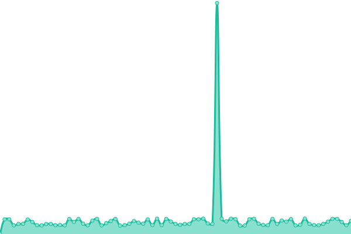
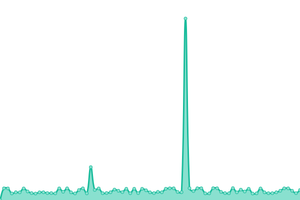
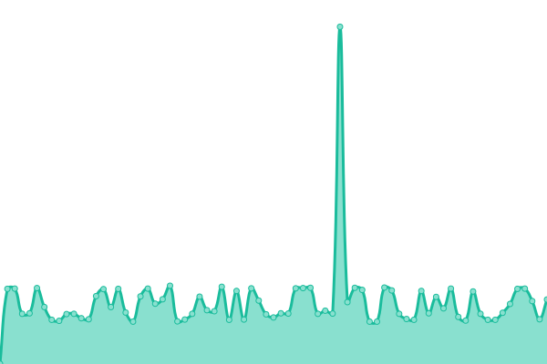

# [📈 Live Status](https://servers.status.spookhost.xyz): <!--live status--> **🟧 Partial outage**

This repository contains the open-source uptime monitor and status page for [Spooky Services](https://hub.spookysrv.com/), powered by [Upptime](https://github.com/upptime/upptime).

With [Upptime](https://upptime.js.org), you can get your own unlimited and free uptime monitor and status page, powered entirely by a GitHub repository. We use [Issues](https://github.com/SpookyServices/Spookhost-Hosting-Servers-Status/issues) as incident reports, [Actions](https://github.com/SpookyServices/Spookhost-Hosting-Servers-Status/actions) as uptime monitors, and [Pages](https://servers.status.spookhost.xyz) for the status page.

<!--start: status pages-->
<!-- This summary is generated by Upptime (https://github.com/upptime/upptime) -->
<!-- Do not edit this manually, your changes will be overwritten -->
<!-- prettier-ignore -->
| URL | Status | History | Response Time | Uptime |
| --- | ------ | ------- | ------------- | ------ |
|  [B] IP Ending with .232 | 🟥 Down | [b-ip-ending-with-232.yml](https://github.com/SpookyServices/Spookhost-Hosting-Servers-Status/commits/HEAD/history/b-ip-ending-with-232.yml) | 

 226ms
     
 | 

<a href="https://servers.status.spookhost.xyz/history/b-ip-ending-with-232">72.97%</a>
    

|  [B] IP Ending with .231 | 🟥 Down | [b-ip-ending-with-231.yml](https://github.com/SpookyServices/Spookhost-Hosting-Servers-Status/commits/HEAD/history/b-ip-ending-with-231.yml) | 

 224ms
     
 | 

<a href="https://servers.status.spookhost.xyz/history/b-ip-ending-with-231">73.68%</a>
    

|  [B] IP Ending with .218 | 🟥 Down | [b-ip-ending-with-218.yml](https://github.com/SpookyServices/Spookhost-Hosting-Servers-Status/commits/HEAD/history/b-ip-ending-with-218.yml) | 

 226ms
     
 | 

<a href="https://servers.status.spookhost.xyz/history/b-ip-ending-with-218">73.52%</a>
    

|  [B] IP Ending with .222 | 🟥 Down | [b-ip-ending-with-222.yml](https://github.com/SpookyServices/Spookhost-Hosting-Servers-Status/commits/HEAD/history/b-ip-ending-with-222.yml) | 

 225ms
     
 | 

<a href="https://servers.status.spookhost.xyz/history/b-ip-ending-with-222">73.80%</a>
    

|  [D] IP Ending with .65 | 🟥 Down | [d-ip-ending-with-65.yml](https://github.com/SpookyServices/Spookhost-Hosting-Servers-Status/commits/HEAD/history/d-ip-ending-with-65.yml) | 

 225ms
     
 | 

<a href="https://servers.status.spookhost.xyz/history/d-ip-ending-with-65">74.08%</a>
    

|  [D] IP Ending with .60 | 🟥 Down | [d-ip-ending-with-60.yml](https://github.com/SpookyServices/Spookhost-Hosting-Servers-Status/commits/HEAD/history/d-ip-ending-with-60.yml) | 

 226ms
     
 | 

<a href="https://servers.status.spookhost.xyz/history/d-ip-ending-with-60">74.64%</a>
    

|  [D] IP Ending with .55 | 🟥 Down | [d-ip-ending-with-55.yml](https://github.com/SpookyServices/Spookhost-Hosting-Servers-Status/commits/HEAD/history/d-ip-ending-with-55.yml) | 

 223ms
     
 | 

<a href="https://servers.status.spookhost.xyz/history/d-ip-ending-with-55">75.57%</a>
    

|  [A] IP Ending with .150 | 🟥 Down | [a-ip-ending-with-150.yml](https://github.com/SpookyServices/Spookhost-Hosting-Servers-Status/commits/HEAD/history/a-ip-ending-with-150.yml) | 

 225ms
     
 | 

<a href="https://servers.status.spookhost.xyz/history/a-ip-ending-with-150">74.91%</a>
    

|  [A] IP Ending with .151 | 🟥 Down | [a-ip-ending-with-151.yml](https://github.com/SpookyServices/Spookhost-Hosting-Servers-Status/commits/HEAD/history/a-ip-ending-with-151.yml) | 

 225ms
     
 | 

<a href="https://servers.status.spookhost.xyz/history/a-ip-ending-with-151">74.71%</a>
    

|  [A] IP Ending with .144 | 🟥 Down | [a-ip-ending-with-144.yml](https://github.com/SpookyServices/Spookhost-Hosting-Servers-Status/commits/HEAD/history/a-ip-ending-with-144.yml) | 

 224ms
     
 | 

<a href="https://servers.status.spookhost.xyz/history/a-ip-ending-with-144">75.46%</a>
    

|  [A] IP Ending with .168 | 🟥 Down | [a-ip-ending-with-168.yml](https://github.com/SpookyServices/Spookhost-Hosting-Servers-Status/commits/HEAD/history/a-ip-ending-with-168.yml) | 

 226ms
     
 | 

<a href="https://servers.status.spookhost.xyz/history/a-ip-ending-with-168">75.74%</a>
    

|  [C] IP Ending with .33 | 🟥 Down | [c-ip-ending-with-33.yml](https://github.com/SpookyServices/Spookhost-Hosting-Servers-Status/commits/HEAD/history/c-ip-ending-with-33.yml) | 

 226ms
     
 | 

<a href="https://servers.status.spookhost.xyz/history/c-ip-ending-with-33">75.56%</a>
    

|  [A] IP Ending with .116 | 🟥 Down | [a-ip-ending-with-116.yml](https://github.com/SpookyServices/Spookhost-Hosting-Servers-Status/commits/HEAD/history/a-ip-ending-with-116.yml) | 

 226ms
     
 | 

<a href="https://servers.status.spookhost.xyz/history/a-ip-ending-with-116">76.30%</a>
    

|  [F] IP Ending with .98 | 🟥 Down | [f-ip-ending-with-98.yml](https://github.com/SpookyServices/Spookhost-Hosting-Servers-Status/commits/HEAD/history/f-ip-ending-with-98.yml) | 

 226ms
     
 | 

<a href="https://servers.status.spookhost.xyz/history/f-ip-ending-with-98">74.57%</a>
    

|  [F] IP Ending with .99 | 🟥 Down | [f-ip-ending-with-99.yml](https://github.com/SpookyServices/Spookhost-Hosting-Servers-Status/commits/HEAD/history/f-ip-ending-with-99.yml) | 

 225ms
     
 | 

<a href="https://servers.status.spookhost.xyz/history/f-ip-ending-with-99">76.85%</a>
    

|  [A] IP Ending with .130 | 🟥 Down | [a-ip-ending-with-130.yml](https://github.com/SpookyServices/Spookhost-Hosting-Servers-Status/commits/HEAD/history/a-ip-ending-with-130.yml) | 

 236ms
     
 | 

<a href="https://servers.status.spookhost.xyz/history/a-ip-ending-with-130">77.13%</a>
    

|  [A] IP Ending with .139 | 🟥 Down | [a-ip-ending-with-139.yml](https://github.com/SpookyServices/Spookhost-Hosting-Servers-Status/commits/HEAD/history/a-ip-ending-with-139.yml) | 

 226ms
     
 | 

<a href="https://servers.status.spookhost.xyz/history/a-ip-ending-with-139">77.41%</a>
    

|  [A] IP Ending with .106 | 🟥 Down | [a-ip-ending-with-106.yml](https://github.com/SpookyServices/Spookhost-Hosting-Servers-Status/commits/HEAD/history/a-ip-ending-with-106.yml) | 

 224ms
     
 | 

<a href="https://servers.status.spookhost.xyz/history/a-ip-ending-with-106">77.69%</a>
    

|  [A] IP Ending with .176 | 🟥 Down | [a-ip-ending-with-176.yml](https://github.com/SpookyServices/Spookhost-Hosting-Servers-Status/commits/HEAD/history/a-ip-ending-with-176.yml) | 

 224ms
     
 | 

<a href="https://servers.status.spookhost.xyz/history/a-ip-ending-with-176">77.97%</a>
    

|  [B] IP Ending with .206 | 🟥 Down | [b-ip-ending-with-206.yml](https://github.com/SpookyServices/Spookhost-Hosting-Servers-Status/commits/HEAD/history/b-ip-ending-with-206.yml) | 

 226ms
     
 | 

<a href="https://servers.status.spookhost.xyz/history/b-ip-ending-with-206">78.34%</a>
    

|  [A] IP Ending with .101 | 🟥 Down | [a-ip-ending-with-101.yml](https://github.com/SpookyServices/Spookhost-Hosting-Servers-Status/commits/HEAD/history/a-ip-ending-with-101.yml) | 

 225ms
     
 | 

<a href="https://servers.status.spookhost.xyz/history/a-ip-ending-with-101">78.52%</a>
    

|  [D] IP Ending with .57 | 🟥 Down | [d-ip-ending-with-57.yml](https://github.com/SpookyServices/Spookhost-Hosting-Servers-Status/commits/HEAD/history/d-ip-ending-with-57.yml) | 

 225ms
     
 | 

<a href="https://servers.status.spookhost.xyz/history/d-ip-ending-with-57">78.80%</a>
    

|  [C] IP Ending with .33 | 🟥 Down | [c-ip-ending-with-33.yml](https://github.com/SpookyServices/Spookhost-Hosting-Servers-Status/commits/HEAD/history/c-ip-ending-with-33.yml) | 

 226ms
     
 | 

<a href="https://servers.status.spookhost.xyz/history/c-ip-ending-with-33">75.56%</a>
    

|  [C] IP Ending with .34 | 🟥 Down | [c-ip-ending-with-34.yml](https://github.com/SpookyServices/Spookhost-Hosting-Servers-Status/commits/HEAD/history/c-ip-ending-with-34.yml) | 

 225ms
     
 | 

<a href="https://servers.status.spookhost.xyz/history/c-ip-ending-with-34">75.05%</a>
    

|  [A] IP Ending with .117 | 🟥 Down | [a-ip-ending-with-117.yml](https://github.com/SpookyServices/Spookhost-Hosting-Servers-Status/commits/HEAD/history/a-ip-ending-with-117.yml) | 

 225ms
     
 | 

<a href="https://servers.status.spookhost.xyz/history/a-ip-ending-with-117">75.33%</a>
    

|  [A] IP Ending with .115 | 🟥 Down | [a-ip-ending-with-115.yml](https://github.com/SpookyServices/Spookhost-Hosting-Servers-Status/commits/HEAD/history/a-ip-ending-with-115.yml) | 

 257ms
     
 | 

<a href="https://servers.status.spookhost.xyz/history/a-ip-ending-with-115">75.78%</a>
    

|  [A] IP Ending with .105 | 🟥 Down | [a-ip-ending-with-105.yml](https://github.com/SpookyServices/Spookhost-Hosting-Servers-Status/commits/HEAD/history/a-ip-ending-with-105.yml) | 

 236ms
     
 | 

<a href="https://servers.status.spookhost.xyz/history/a-ip-ending-with-105">74.40%</a>
    

|  [D] IP Ending with .59 | 🟥 Down | [d-ip-ending-with-59.yml](https://github.com/SpookyServices/Spookhost-Hosting-Servers-Status/commits/HEAD/history/d-ip-ending-with-59.yml) | 

 224ms
     
 | 

<a href="https://servers.status.spookhost.xyz/history/d-ip-ending-with-59">74.88%</a>
    

|  [A] IP Ending with .107 | 🟥 Down | [a-ip-ending-with-107.yml](https://github.com/SpookyServices/Spookhost-Hosting-Servers-Status/commits/HEAD/history/a-ip-ending-with-107.yml) | 

 225ms
     
 | 

<a href="https://servers.status.spookhost.xyz/history/a-ip-ending-with-107">75.15%</a>
    

|  [A] IP Ending with .133 | 🟥 Down | [a-ip-ending-with-133.yml](https://github.com/SpookyServices/Spookhost-Hosting-Servers-Status/commits/HEAD/history/a-ip-ending-with-133.yml) | 

 225ms
     
 | 

<a href="https://servers.status.spookhost.xyz/history/a-ip-ending-with-133">75.21%</a>
    

|  [F] IP Ending with .92 | 🟥 Down | [f-ip-ending-with-92.yml](https://github.com/SpookyServices/Spookhost-Hosting-Servers-Status/commits/HEAD/history/f-ip-ending-with-92.yml) | 

 225ms
     
 | 

<a href="https://servers.status.spookhost.xyz/history/f-ip-ending-with-92">75.70%</a>
    

|  [A] IP Ending with .120 | 🟥 Down | [a-ip-ending-with-120.yml](https://github.com/SpookyServices/Spookhost-Hosting-Servers-Status/commits/HEAD/history/a-ip-ending-with-120.yml) | 

 241ms
     
 | 

<a href="https://servers.status.spookhost.xyz/history/a-ip-ending-with-120">80.32%</a>
    

|  [B] IP Ending with .213 | 🟥 Down | [b-ip-ending-with-213.yml](https://github.com/SpookyServices/Spookhost-Hosting-Servers-Status/commits/HEAD/history/b-ip-ending-with-213.yml) | 

 225ms
     
 | 

<a href="https://servers.status.spookhost.xyz/history/b-ip-ending-with-213">76.39%</a>
    

|  [B] IP Ending with .217 | 🟥 Down | [b-ip-ending-with-217.yml](https://github.com/SpookyServices/Spookhost-Hosting-Servers-Status/commits/HEAD/history/b-ip-ending-with-217.yml) | 

 225ms
     
 | 

<a href="https://servers.status.spookhost.xyz/history/b-ip-ending-with-217">76.81%</a>
    

|  [B] IP Ending with .252 | 🟥 Down | [b-ip-ending-with-252.yml](https://github.com/SpookyServices/Spookhost-Hosting-Servers-Status/commits/HEAD/history/b-ip-ending-with-252.yml) | 

 225ms
     
 | 

<a href="https://servers.status.spookhost.xyz/history/b-ip-ending-with-252">77.05%</a>
    

|  [A] IP Ending with .174 | 🟥 Down | [a-ip-ending-with-174.yml](https://github.com/SpookyServices/Spookhost-Hosting-Servers-Status/commits/HEAD/history/a-ip-ending-with-174.yml) | 

 224ms
     
 | 

<a href="https://servers.status.spookhost.xyz/history/a-ip-ending-with-174">77.77%</a>
    

|  [A] IP Ending with .171 | 🟥 Down | [a-ip-ending-with-171.yml](https://github.com/SpookyServices/Spookhost-Hosting-Servers-Status/commits/HEAD/history/a-ip-ending-with-171.yml) | 

 228ms
     
 | 

<a href="https://servers.status.spookhost.xyz/history/a-ip-ending-with-171">78.31%</a>
    

|  [A] IP Ending with .160 | 🟥 Down | [a-ip-ending-with-160.yml](https://github.com/SpookyServices/Spookhost-Hosting-Servers-Status/commits/HEAD/history/a-ip-ending-with-160.yml) | 

 225ms
     
 | 

<a href="https://servers.status.spookhost.xyz/history/a-ip-ending-with-160">78.78%</a>
    

|  [A] IP Ending with .146 | 🟥 Down | [a-ip-ending-with-146.yml](https://github.com/SpookyServices/Spookhost-Hosting-Servers-Status/commits/HEAD/history/a-ip-ending-with-146.yml) | 

 224ms
     
 | 

<a href="https://servers.status.spookhost.xyz/history/a-ip-ending-with-146">79.34%</a>
    

|  [A] IP Ending with .148 | 🟩 Up | [a-ip-ending-with-148.yml](https://github.com/SpookyServices/Spookhost-Hosting-Servers-Status/commits/HEAD/history/a-ip-ending-with-148.yml) | 

 241ms
     
 | 

<a href="https://servers.status.spookhost.xyz/history/a-ip-ending-with-148">79.97%</a>
    

|  [A] IP Ending with .149 | 🟥 Down | [a-ip-ending-with-149.yml](https://github.com/SpookyServices/Spookhost-Hosting-Servers-Status/commits/HEAD/history/a-ip-ending-with-149.yml) | 

 224ms
     
 | 

<a href="https://servers.status.spookhost.xyz/history/a-ip-ending-with-149">80.50%</a>
    

|  [A] IP Ending with .177 | 🟥 Down | [a-ip-ending-with-177.yml](https://github.com/SpookyServices/Spookhost-Hosting-Servers-Status/commits/HEAD/history/a-ip-ending-with-177.yml) | 

 224ms
     
 | 

<a href="https://servers.status.spookhost.xyz/history/a-ip-ending-with-177">81.21%</a>
    

|  [A] IP Ending with .178 | 🟥 Down | [a-ip-ending-with-178.yml](https://github.com/SpookyServices/Spookhost-Hosting-Servers-Status/commits/HEAD/history/a-ip-ending-with-178.yml) | 

 232ms
     
 | 

<a href="https://servers.status.spookhost.xyz/history/a-ip-ending-with-178">81.54%</a>
    

|  [A] IP Ending with .165 | 🟥 Down | [a-ip-ending-with-165.yml](https://github.com/SpookyServices/Spookhost-Hosting-Servers-Status/commits/HEAD/history/a-ip-ending-with-165.yml) | 

 224ms
     
 | 

<a href="https://servers.status.spookhost.xyz/history/a-ip-ending-with-165">78.85%</a>
    

|  [A] IP Ending with .166 | 🟥 Down | [a-ip-ending-with-166.yml](https://github.com/SpookyServices/Spookhost-Hosting-Servers-Status/commits/HEAD/history/a-ip-ending-with-166.yml) | 

 224ms
     
 | 

<a href="https://servers.status.spookhost.xyz/history/a-ip-ending-with-166">79.02%</a>
    

|  [A] IP Ending with .167 | 🟥 Down | [a-ip-ending-with-167.yml](https://github.com/SpookyServices/Spookhost-Hosting-Servers-Status/commits/HEAD/history/a-ip-ending-with-167.yml) | 

 226ms
     
 | 

<a href="https://servers.status.spookhost.xyz/history/a-ip-ending-with-167">79.59%</a>
    

|  [A] IP Ending with .170 | 🟥 Down | [a-ip-ending-with-170.yml](https://github.com/SpookyServices/Spookhost-Hosting-Servers-Status/commits/HEAD/history/a-ip-ending-with-170.yml) | 

 275ms
     
 | 

<a href="https://servers.status.spookhost.xyz/history/a-ip-ending-with-170">79.51%</a>
    

|  [A] IP Ending with .122 | 🟥 Down | [a-ip-ending-with-122.yml](https://github.com/SpookyServices/Spookhost-Hosting-Servers-Status/commits/HEAD/history/a-ip-ending-with-122.yml) | 

 225ms
     
 | 

<a href="https://servers.status.spookhost.xyz/history/a-ip-ending-with-122">77.97%</a>
    

|  [A] IP Ending with .123 | 🟥 Down | [a-ip-ending-with-123.yml](https://github.com/SpookyServices/Spookhost-Hosting-Servers-Status/commits/HEAD/history/a-ip-ending-with-123.yml) | 

 241ms
     
 | 

<a href="https://servers.status.spookhost.xyz/history/a-ip-ending-with-123">78.31%</a>
    

|  [A] IP Ending with .104 | 🟥 Down | [a-ip-ending-with-104.yml](https://github.com/SpookyServices/Spookhost-Hosting-Servers-Status/commits/HEAD/history/a-ip-ending-with-104.yml) | 

 225ms
     
 | 

<a href="https://servers.status.spookhost.xyz/history/a-ip-ending-with-104">77.25%</a>
    

|  [A] IP Ending with .125 | 🟥 Down | [a-ip-ending-with-125.yml](https://github.com/SpookyServices/Spookhost-Hosting-Servers-Status/commits/HEAD/history/a-ip-ending-with-125.yml) | 

 225ms
     
 | 

<a href="https://servers.status.spookhost.xyz/history/a-ip-ending-with-125">77.86%</a>
    

|  [B] IP Ending with .215 | 🟥 Down | [b-ip-ending-with-215.yml](https://github.com/SpookyServices/Spookhost-Hosting-Servers-Status/commits/HEAD/history/b-ip-ending-with-215.yml) | 

 225ms
     
 | 

<a href="https://servers.status.spookhost.xyz/history/b-ip-ending-with-215">78.01%</a>
    

|  [A] IP Ending with .108 | 🟥 Down | [a-ip-ending-with-108.yml](https://github.com/SpookyServices/Spookhost-Hosting-Servers-Status/commits/HEAD/history/a-ip-ending-with-108.yml) | 

 228ms
     
 | 

<a href="https://servers.status.spookhost.xyz/history/a-ip-ending-with-108">76.71%</a>
    

|  [B] IP Ending with .224 | 🟥 Down | [b-ip-ending-with-224.yml](https://github.com/SpookyServices/Spookhost-Hosting-Servers-Status/commits/HEAD/history/b-ip-ending-with-224.yml) | 

 234ms
     
 | 

<a href="https://servers.status.spookhost.xyz/history/b-ip-ending-with-224">78.38%</a>
    

|  [O] IP Ending with .42 | 🟥 Down | [o-ip-ending-with-42.yml](https://github.com/SpookyServices/Spookhost-Hosting-Servers-Status/commits/HEAD/history/o-ip-ending-with-42.yml) | 

 225ms
     
 | 

<a href="https://servers.status.spookhost.xyz/history/o-ip-ending-with-42">78.67%</a>
    

|  [O] IP Ending with .41 | 🟥 Down | [o-ip-ending-with-41.yml](https://github.com/SpookyServices/Spookhost-Hosting-Servers-Status/commits/HEAD/history/o-ip-ending-with-41.yml) | 

 225ms
     
 | 

<a href="https://servers.status.spookhost.xyz/history/o-ip-ending-with-41">79.11%</a>
    

|  [A] IP Ending with .102 | 🟥 Down | [a-ip-ending-with-102.yml](https://github.com/SpookyServices/Spookhost-Hosting-Servers-Status/commits/HEAD/history/a-ip-ending-with-102.yml) | 

 225ms
     
 | 

<a href="https://servers.status.spookhost.xyz/history/a-ip-ending-with-102">78.62%</a>
    

|  [A] IP Ending with .195 | 🟥 Down | [a-ip-ending-with-195.yml](https://github.com/SpookyServices/Spookhost-Hosting-Servers-Status/commits/HEAD/history/a-ip-ending-with-195.yml) | 

 224ms
     
 | 

<a href="https://servers.status.spookhost.xyz/history/a-ip-ending-with-195">79.53%</a>
    

<!--end: status pages-->

[**Visit our status website →**](https://servers.status.spookhost.xyz)

## 📄 License

- Powered by: [Upptime](https://github.com/upptime/upptime)
- Code: [MIT](./LICENSE) © [Spooky Services](https://hub.spookysrv.com/)
- Data in the `./history` directory: [Open Database License](https://opendatacommons.org/licenses/odbl/1-0/)
